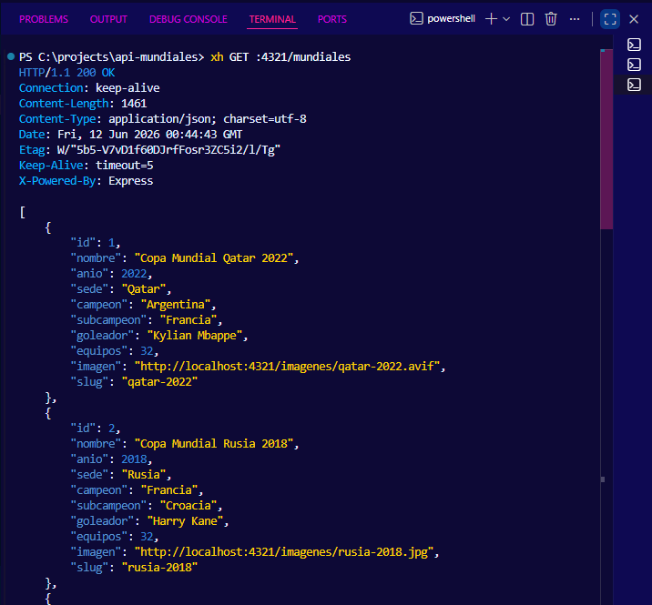
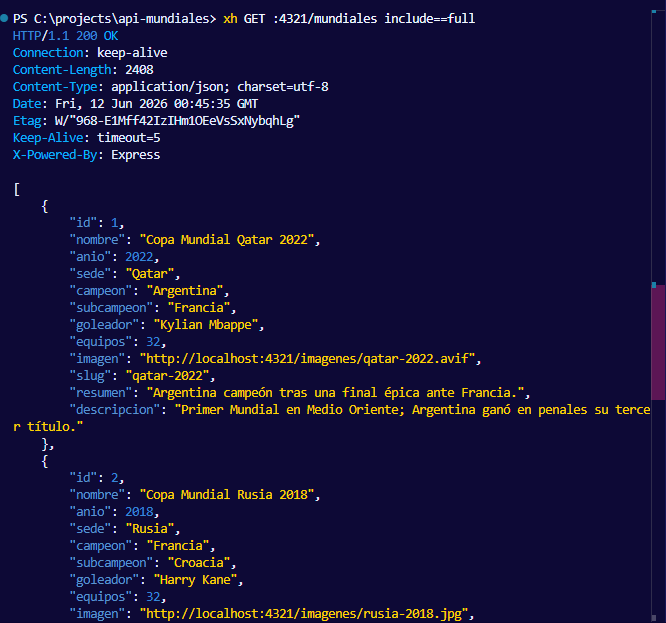
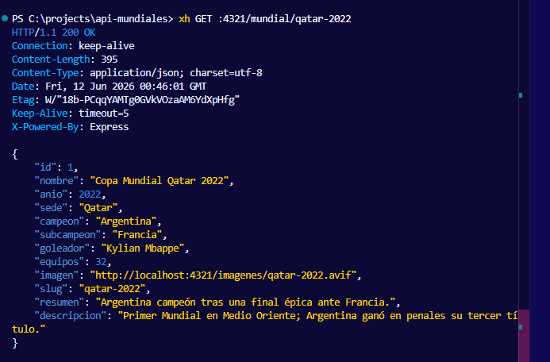
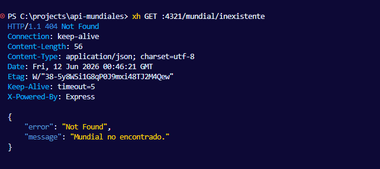
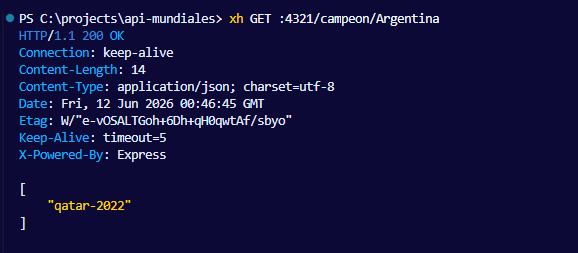
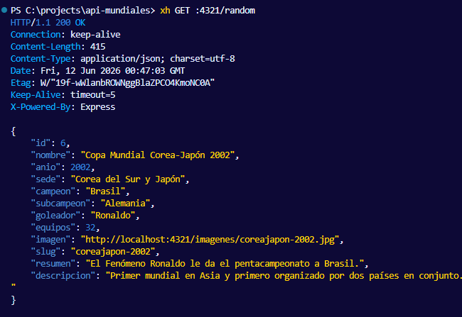
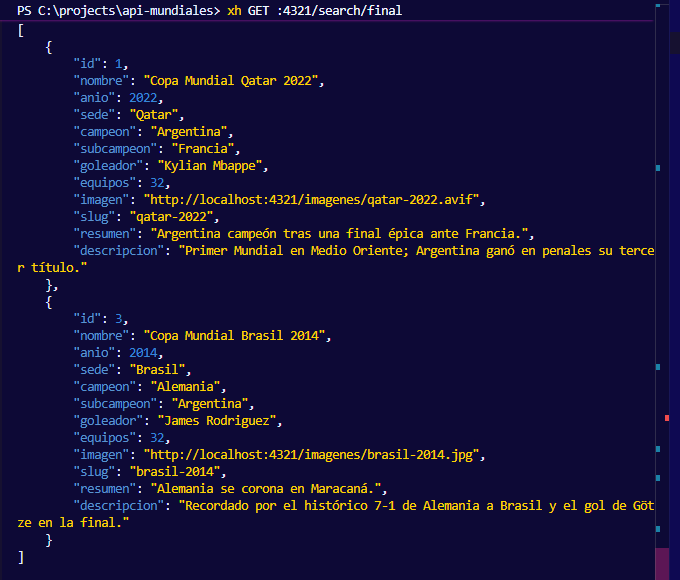
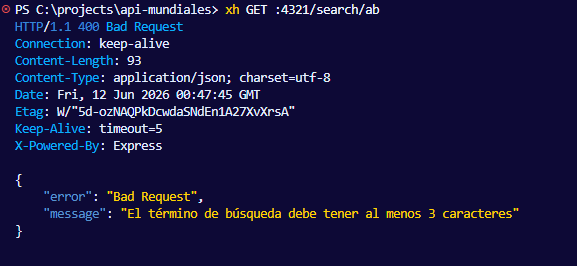

# API Copa Mundial de la FIFA

Este repositorio contiene una API REST desarrollada con Node.js, Express y SQLite sobre la historia de los Mundiales.

## ¿Cómo ejecutar el proyecto?

1. Instala las dependencias:
   \`\`\`bash
   npm install
   \`\`\`
2. Pobla la base de datos y crea la tabla SQLite (ejecutar solo la primera vez):
   \`\`\`bash
   node seed.js
   \`\`\`
3. Levanta el servidor:
   \`\`\`bash
   node server.js
   \`\`\`
4. El servidor estará escuchando en `http://localhost:4321`.

## Pruebas de los Endpoints (usando xh)

A continuación, se presentan las capturas de pantalla de cada endpoint funcional de la API REST:

| Endpoint | Descripción | Captura |
| :--- | :--- | :--- |
| `GET /mundiales` | Listado estándar |  |
| `GET /mundiales?include=full` | Listado completo |  |
| `GET /mundial/qatar-2022` | Consulta por slug |  |
| `GET /mundial/inexistente` | Manejo de error 404 |  |
| `GET /campeon/Argentina` | Filtro por campeón |  |
| `GET /random` | Mundial al azar |  |
| `GET /search/final` | Búsqueda por texto |  |
| `GET /search/ab` | Validación Zod (400) |  |